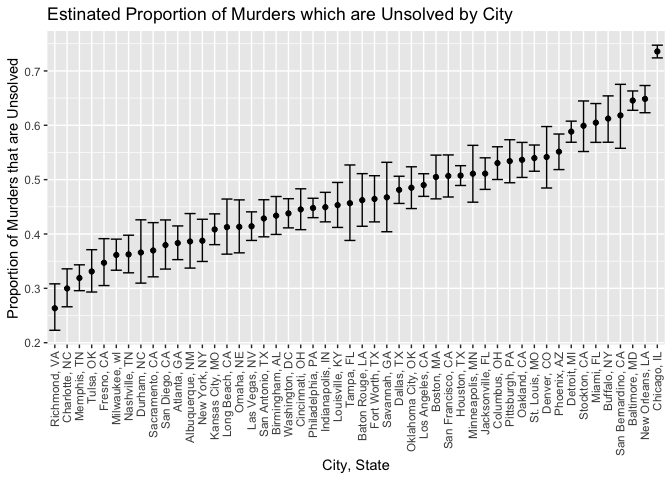

jgc2157\_hw5
================
Gunnar
11/15/2021

libraries

``` r
library(tidyverse)
```

    ## ── Attaching packages ─────────────────────────────────────── tidyverse 1.3.1 ──

    ## ✓ ggplot2 3.3.5     ✓ purrr   0.3.4
    ## ✓ tibble  3.1.4     ✓ dplyr   1.0.7
    ## ✓ tidyr   1.1.3     ✓ stringr 1.4.0
    ## ✓ readr   2.0.1     ✓ forcats 0.5.1

    ## ── Conflicts ────────────────────────────────────────── tidyverse_conflicts() ──
    ## x dplyr::filter() masks stats::filter()
    ## x dplyr::lag()    masks stats::lag()

``` r
library(janitor)
```

    ## 
    ## Attaching package: 'janitor'

    ## The following objects are masked from 'package:stats':
    ## 
    ##     chisq.test, fisher.test

Reading homicide csv from github

``` r
urlfile <- 'https://raw.githubusercontent.com/washingtonpost/data-homicides/master/homicide-data.csv'
homicides_df <- read_csv(url(urlfile), na = c(" ", "Unknown"))
```

\#\#\#Describing the raw dataset

The homicide data set contains 52,168 observations across 11 columns.
Variables in the data set include unique id, reported date of murder,
victim’s last name, victim’s first name, victim’s race, victim’s age,
victim’s sex, city, state, latitidue, longitude, and disposition of the
case.

Creating city\_state variable

``` r
homicides_df <- homicides_df %>%
  mutate(city_state = str_c(city, state, sep = ", "),
         resolution = case_when(
           disposition == "Closed without arrest" ~ "unsolved",
           disposition == "Open/No arrest" ~ "unsolved",
           disposition == "Closed by arrest" ~ "solved")) %>%
  relocate(city_state) %>%
  filter(city_state != "Tulsa, AL")
```

Filter to Baltimore

``` r
baltimore_df <- homicides_df %>%
  filter(city_state == "Baltimore, MD")

baltimore_summary <- baltimore_df %>%
  summarise(
    unsolved = sum(resolution == "unsolved"),
    n = n()
  )

baltimore_test <- prop.test(
  x = baltimore_summary %>% pull(unsolved),
  n = baltimore_summary %>% pull(n)
)

baltimore_test %>%
  broom::tidy()
```

    ## # A tibble: 1 × 8
    ##   estimate statistic  p.value parameter conf.low conf.high method    alternative
    ##      <dbl>     <dbl>    <dbl>     <int>    <dbl>     <dbl> <chr>     <chr>      
    ## 1    0.646      239. 6.46e-54         1    0.628     0.663 1-sample… two.sided

Table of unsolved and total murders for each city

``` r
homicides_df %>%
  group_by(city_state) %>%
  summarise(
    unsolved = sum(resolution == "unsolved"),
    n = n()) %>%
  knitr::kable(col.names = c("City", "Unsolved Murders", "Total Murders"))
```

| City               | Unsolved Murders | Total Murders |
|:-------------------|-----------------:|--------------:|
| Albuquerque, NM    |              146 |           378 |
| Atlanta, GA        |              373 |           973 |
| Baltimore, MD      |             1825 |          2827 |
| Baton Rouge, LA    |              196 |           424 |
| Birmingham, AL     |              347 |           800 |
| Boston, MA         |              310 |           614 |
| Buffalo, NY        |              319 |           521 |
| Charlotte, NC      |              206 |           687 |
| Chicago, IL        |             4073 |          5535 |
| Cincinnati, OH     |              309 |           694 |
| Columbus, OH       |              575 |          1084 |
| Dallas, TX         |              754 |          1567 |
| Denver, CO         |              169 |           312 |
| Detroit, MI        |             1482 |          2519 |
| Durham, NC         |              101 |           276 |
| Fort Worth, TX     |              255 |           549 |
| Fresno, CA         |              169 |           487 |
| Houston, TX        |             1493 |          2942 |
| Indianapolis, IN   |              594 |          1322 |
| Jacksonville, FL   |              597 |          1168 |
| Kansas City, MO    |              486 |          1190 |
| Las Vegas, NV      |              572 |          1381 |
| Long Beach, CA     |              156 |           378 |
| Los Angeles, CA    |             1106 |          2257 |
| Louisville, KY     |              261 |           576 |
| Memphis, TN        |              483 |          1514 |
| Miami, FL          |              450 |           744 |
| Milwaukee, wI      |              403 |          1115 |
| Minneapolis, MN    |              187 |           366 |
| Nashville, TN      |              278 |           767 |
| New Orleans, LA    |              930 |          1434 |
| New York, NY       |              243 |           627 |
| Oakland, CA        |              508 |           947 |
| Oklahoma City, OK  |              326 |           672 |
| Omaha, NE          |              169 |           409 |
| Philadelphia, PA   |             1360 |          3037 |
| Phoenix, AZ        |              504 |           914 |
| Pittsburgh, PA     |              337 |           631 |
| Richmond, VA       |              113 |           429 |
| Sacramento, CA     |              139 |           376 |
| San Antonio, TX    |              357 |           833 |
| San Bernardino, CA |              170 |           275 |
| San Diego, CA      |              175 |           461 |
| San Francisco, CA  |              336 |           663 |
| Savannah, GA       |              115 |           246 |
| St. Louis, MO      |              905 |          1677 |
| Stockton, CA       |              266 |           444 |
| Tampa, FL          |               95 |           208 |
| Tulsa, OK          |              193 |           583 |
| Washington, DC     |              589 |          1345 |

Iterate across cities First, write a prop.test function and test on a
sample city

``` r
prop_test_function <- function(city_df) {
  
  city_summary <- city_df %>%
  summarise(
    unsolved = sum(resolution == "unsolved"),
    n = n()
  )

  city_test <- prop.test(
    x = city_summary %>% pull(unsolved),
    n = city_summary %>% pull(n))
  return(city_test)
}

prop_test_function(baltimore_df)
```

    ## 
    ##  1-sample proportions test with continuity correction
    ## 
    ## data:  city_summary %>% pull(unsolved) out of city_summary %>% pull(n), null probability 0.5
    ## X-squared = 239.01, df = 1, p-value < 2.2e-16
    ## alternative hypothesis: true p is not equal to 0.5
    ## 95 percent confidence interval:
    ##  0.6275625 0.6631599
    ## sample estimates:
    ##         p 
    ## 0.6455607

Now iterate across all cities

``` r
results_df <- homicides_df %>%
  nest(data = uid:resolution) %>%
  mutate(
    test_results = map(data, prop_test_function),
    tidy_results = map(test_results, broom::tidy)
  ) %>%
  select(city_state, tidy_results) %>%
  unnest(tidy_results) %>%
  select(city_state, estimate, starts_with("conf"))
```

Plot of estimates and error bars for each city

``` r
results_df %>%
  mutate(city_state = fct_reorder(city_state, estimate)) %>%
  ggplot(aes(x = city_state, y = estimate)) +
  geom_point() +
  geom_errorbar(aes(ymin = conf.low, ymax = conf.high)) +
  theme(axis.text.x = element_text(angle = 90, vjust = 0.5, hjust = 1)) +
  xlab("City, State") +
  ylab("Proportion of Murders that are Unsolved") +
  ggtitle("Estinated Proportion of Murders which are Unsolved by City")
```

<!-- -->

## Problem 2

Reading in the data, adding “data/” prefix to files Then creating nested
data for each of the respondents Separate participants by control vs
experiment and number unnest study data and pivot long

``` r
files_df <- tibble(
  files = list.files("./data")) %>%
  mutate(files = str_c("data", files, sep = "/"))

research_df <- files_df %>%
  mutate(respondents = map(files, read_csv)) %>%
  mutate(study_arm = case_when(str_detect(files, "exp") ~ "experiment",
                               str_detect(files, "con") ~ "control"),
         participant_number = as.factor(parse_number(files))) %>%
  unnest(respondents) %>%
  pivot_longer(cols = week_1:week_8, names_to = "week", values_to = "observations") %>%
  mutate(week = as.numeric(parse_number(week)))
```

Create spaghetti graph of observations over time split by study arm

``` r
research_df %>%
  ggplot(aes(x = week, y = observations, color = participant_number)) +
  geom_line() +
  ylab("Observations") +
  xlab("Weeks") +
  facet_grid(cols = vars(study_arm)) +
  ggtitle("Observations Over Time by Study Arm")
```

<!-- -->

In the above charts showing observations over time stratified by study
arm, participants in the control arm appear to report the same
observation over time while in the exeriment arm, participants appear to
be reporting higher observations as time goes on.

## Problem 3

Loading iris data

``` r
set.seed(10)

iris_with_missing <- iris %>%
  map_df(~replace(.x, sample(1:150, 20), NA)) %>%
  mutate(species = as.character(Species))
```

Writing function to replace missing values

``` r
#first testing code
iris_with_missing %>%
  mutate(Sepal.Length = ifelse(is.na(Sepal.Length), mean(Sepal.Length, na.rm = TRUE), Sepal.Length), species = ifelse(is.na(species), "virginica", species)) 
```

    ## # A tibble: 150 × 6
    ##    Sepal.Length Sepal.Width Petal.Length Petal.Width Species species
    ##           <dbl>       <dbl>        <dbl>       <dbl> <fct>   <chr>  
    ##  1         5.1          3.5          1.4         0.2 setosa  setosa 
    ##  2         4.9          3            1.4         0.2 setosa  setosa 
    ##  3         4.7          3.2          1.3         0.2 setosa  setosa 
    ##  4         4.6          3.1          1.5        NA   setosa  setosa 
    ##  5         5            3.6          1.4         0.2 setosa  setosa 
    ##  6         5.4          3.9          1.7         0.4 setosa  setosa 
    ##  7         5.82         3.4          1.4         0.3 setosa  setosa 
    ##  8         5            3.4          1.5         0.2 setosa  setosa 
    ##  9         4.4          2.9          1.4         0.2 setosa  setosa 
    ## 10         4.9          3.1         NA           0.1 setosa  setosa 
    ## # … with 140 more rows

``` r
#function
na_func <- function(x) {
  if(is.numeric(x)) {
    x = ifelse(is.na(x), mean(x, na.rm = TRUE), x)
  } else if(is.character(x)) {
    x = ifelse(is.na(x), "virginica", x)
  }
  return(x)
}
```

Map na\_func to the iris\_with\_missing data set

``` r
iris_no_na <- map_df(iris_with_missing, na_func)

#testing the new data set
iris_no_na %>%
  tail()
```

    ## # A tibble: 6 × 6
    ##   Sepal.Length Sepal.Width Petal.Length Petal.Width Species   species  
    ##          <dbl>       <dbl>        <dbl>       <dbl> <fct>     <chr>    
    ## 1         6.7          3.3         3.77         2.5 virginica virginica
    ## 2         6.7          3           5.2          2.3 virginica virginica
    ## 3         6.3          2.5         5            1.9 <NA>      virginica
    ## 4         6.5          3           5.2          2   <NA>      virginica
    ## 5         5.82         3.4         5.4          2.3 virginica virginica
    ## 6         5.9          3           5.1          1.8 virginica virginica
